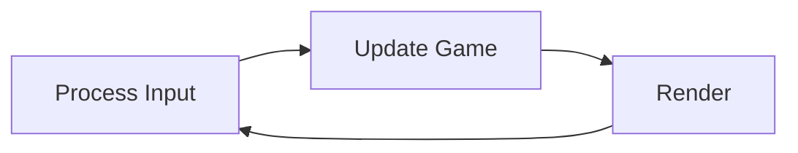

## Game Loop

**Game Loop（游戏循环）** 是游戏程序的核心控制结构，它在无限循环中不断重复三个基本步骤：处理输入、更新游戏状态、渲染画面。每一次完整的循环执行称为一**帧（Frame）**，通过不断生成新帧来实现游戏的实时交互和动态效果。

### 循环流程



```cpp
while (true) {
	game->processInput();
	game->update();
	game->render();
}
```
