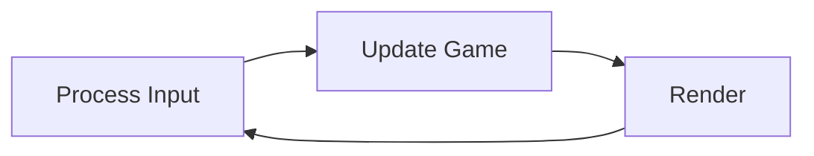

# Concept
## Game Loop

**Game Loop（游戏循环）** 是游戏程序的核心控制结构，它在无限循环中不断重复三个基本步骤：处理输入、更新游戏状态、渲染画面。每一次完整的循环执行称为一**帧（Frame）**，通过不断生成新帧来实现游戏的实时交互和动态效果。

### 循环流程



```cpp
while (true) {
	game->processInput();
	game->update();
	game->render();
}
```


# Episode 015 — 项目启动：环境与构建系统

> [!summary] 一句话总结
> 本集不写引擎代码，而是搭好整个**开发环境与构建链**：CMake + vcpkg + mise + VSCode，准备好所有依赖（SDL3 全家桶 / glm / ImGui / Lua），留下一个空的 `main.cpp` 作为起点。

## 分支终态概览

`015-game-loop` 的终态是一个**环境就绪、代码为空**的起点：

- 构建链（CMake + vcpkg + mise + VSCode 配置）全部到位；
- 课程素材 `assets/`（字体、坦克/直升机贴图、丛林 tilemap、音效）已就位；
- 唯一的源文件 `src/main.cpp` 只是一个 `// TODO` 空壳。

## 技术栈一览

依赖通过 `vcpkg.json` 声明：

| 依赖 | 用途 |
|------|------|
| **SDL3** | 窗口、输入、音频等平台层 |
| **SDL3_image**（png/jpeg/webp） | 图片加载 |
| **SDL3_ttf**（harfbuzz/svg） | 字体渲染 |
| **SDL3_mixer**（vorbis/mp3/flac/opus） | 音频混音播放 |
| **glm** | 数学库（向量、矩阵） |
| **imgui** (Dear ImGui) | 编辑器 / 调试 UI |
| **sol2** + **lua** | Lua 脚本绑定（引擎将对外暴露 Lua API） |
| **WebP** | WebP 图片格式支持 |

> [!tip] 这套组合的意图
> 这正是 Pikuma “2D 游戏引擎”课程的经典技术栈：SDL 做底层、glm 做数学、ImGui 做开发期工具、Lua+sol2 让游戏逻辑可脚本化。后续 episode 会逐一把它们接进 `Game` 类。

## 项目目录结构

```
pikuma_2d_engine/
├── CMakeLists.txt              # 构建脚本
├── CMakeUserPresets.json       # CMake presets（debug/release/windows…）
├── vcpkg.json                  # 依赖清单
├── vcpkg-configuration.json    # vcpkg registry / baseline
├── mise.toml / mise.toml.sample  # 环境变量（VCPKG_ROOT）
├── .vscode/
│   ├── tasks.json              # 构建/配置任务（通过 mise 调用 cmake）
│   └── launch.json             # 调试配置（LLDB / vsdbg）
├── assets/                     # 课程素材（字体/图片/音效/tilemap）
└── src/
    └── main.cpp                # 唯一源文件，目前为空壳
```

## 构建系统：CMake + vcpkg

### `CMakeLists.txt`关键点

```cmake
cmake_minimum_required(VERSION 3.25)
project(pikuma_2d_engine LANGUAGES CXX)

# 1) 依赖：全部用 CONFIG 模式（vcpkg 安装的包都提供 xxx-config.cmake）
find_package(glm CONFIG REQUIRED)
find_package(SDL3 CONFIG REQUIRED)
find_package(SDL3_image CONFIG REQUIRED)
# … ttf / mixer / imgui / lua / sol2

# 2) 可执行目标——此刻只有一个源文件
add_executable(main "${CMAKE_CURRENT_SOURCE_DIR}/src/main.cpp")

# 3) C++17
target_compile_features(main PRIVATE cxx_std_17)

# 4) 警告：非 MSVC 用 -Wall -Wextra -Wpedantic；MSVC 用 /W4
target_compile_options(main PRIVATE ...)

# 5) 链接库（含静态/动态自适应的生成器表达式）
target_link_libraries(main PRIVATE imgui::imgui glm::glm sol2::sol2 ...)

# 6) 构建后把 assets/ 拷贝到输出目录，保证运行时能找到素材
add_custom_command(TARGET main POST_BUILD
    COMMAND ${CMAKE_COMMAND} -E copy_directory
        "${CMAKE_CURRENT_SOURCE_DIR}/assets" "$<TARGET_FILE_DIR:main>/assets")
```

几个值得记住的设计：
- **`find_package(... CONFIG REQUIRED)`**：依赖来自 vcpkg，全部以 config 模式查找。
- **`CMAKE_EXPORT_COMPILE_COMMANDS=ON`**（见 presets）：生成 `compile_commands.json`，供 clangd / IDE 智能提示。
- **POST_BUILD 拷贝 assets**：可执行文件运行时按相对路径读 `assets/`，所以每次构建都同步一份到输出目录。

### vcpkg 清单模式

`vcpkg.json`用**清单模式（manifest mode）**声明依赖，带 `features` 精细控制每个库启用的编解码器/格式：

```json
{ "name": "sdl3-mixer", "features": ["libvorbis", "mpg123", "libflac", "opusfile"] }
```

`vcpkg-configuration.json` 固定了 registry 与 baseline，保证团队/不同机器上构建结果一致。

## CMake Presets（多平台 / 多构建类型）

`CMakeUserPresets.json` 定义了一套可继承的 preset 体系：

```
base（hidden）  ── 指向 $env{VCPKG_ROOT}/scripts/buildsystems/vcpkg.cmake 工具链
├── ninja（hidden）   ── Ninja 生成器 + 导出 compile_commands.json
│   ├── debug          ── CMAKE_BUILD_TYPE=Debug
│   ├── release        ── Release
│   └── relwithdebinfo ── RelWithDebInfo
└── vs2026（hidden）   ── Visual Studio 18 2026 生成器
    ├── windows-debug
    ├── windows-release
    └── windows-relwithdebinfo
```

> [!important] 关键一行
> `"CMAKE_TOOLCHAIN_FILE": "$env{VCPKG_ROOT}/scripts/buildsystems/vcpkg.cmake"`
> 这行让 CMake 通过 vcpkg 的工具链文件去找依赖。`VCPKG_ROOT` 必须在环境中存在——这就是下一步 `mise` 要解决的事。

## mise：管理 VCPKG_ROOT

`mise.toml.sample`（拷贝为 `mise.toml` 后生效）：

```toml
[env]
VCPKG_ROOT = ""        # 填你本地 vcpkg 的安装路径
_.path = "{{env.VCPKG_ROOT}}"
```

`mise` 在进入项目目录时自动把这些环境变量注入 shell，于是 CMake preset 里的 `$env{VCPKG_ROOT}` 就能正确展开。所有 VSCode 任务也都通过 `mise exec -- cmake ...` 来执行，确保环境一致。

## VSCode 集成：一键构建与调试

`.vscode/tasks.json` 提供了标准化任务（全部经 `mise exec` 调用 cmake）：

| 任务                                              | 作用                             |
| ----------------------------------------------- | ------------------------------ |
| `CMake: Configure Debug/Release/RelWithDebInfo` | `cmake --preset=xxx` 配置        |
| `Build: Debug`（默认构建任务）                          | `cmake --build --preset=debug` |
| `Build: Release / RelWithDebInfo`               | 对应构建                           |
| `Clean Build`                                   | 删除 `build/`                    |
|                                                 |                                |

`.vscode/launch.json` 提供调试配置：
- **macOS/Linux**：`lldb` 调试 `build/<preset>/main`，预先跑 `Build: Debug`。
- **Windows**：`cppvsdbg` (vsdbg) 调试 `build/windows-*/<Config>/main.exe`。

## 唯一的源码：空壳 main.cpp

```cpp
#include <iostream>

int main(int argc, char *argv[])
{
    // TODO: Do some Magic!
    return 0;
}
```

整个引擎此时还只是一个 `// TODO`。能编译、能链接、能跑——只是什么都不做。这是刻意留的空白画布。

## 构建与运行流程

```bash
# 1. 准备环境（一次性）
cp mise.toml.sample mise.toml   # 填入 VCPKG_ROOT

# 2. 配置 + 构建
mise exec -- cmake --preset=debug
mise exec -- cmake --build --preset=debug

# 3. 运行
./build/debug/main              # assets/ 已被 POST_BUILD 拷贝过去
```

或在 VSCode 里直接 `Ctrl+Shift+B`（默认 Build: Debug）→ F5 调试。

## 要点总结

- ✅ **构建链就绪**：CMake 3.25 + vcpkg 清单模式 + CMake Presets + mise 管理环境。
- ✅ **跨平台**：Ninja（macOS/Linux）与 Visual Studio（Windows）双生成器，调试器分别用 LLDB / vsdbg。
- ✅ **依赖齐全**：SDL3 全家桶 + glm + ImGui + Lua/sol2，全部声明在 `vcpkg.json`。
- ✅ **素材先行**：`assets/` 已就位，构建后自动拷贝到输出目录。
- ✅ **代码为空**：只有一个 `// TODO` 的 `main.cpp`，等待引擎逻辑入驻。